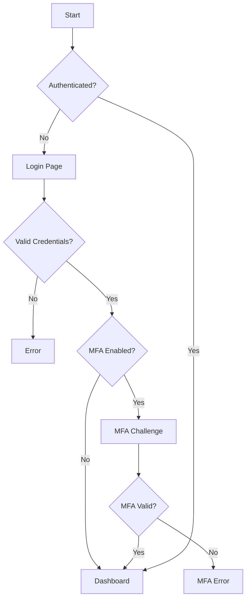

# Execution-path mapping payloads & references

Reference from `skill://wstg-info-07/SKILL.md` Procedure steps 1–10. Replace `TARGET` with the in-scope host.

## Crawler reference

```bash
zap-cli -p 8090 spider https://TARGET
zap-cli -p 8090 ajax-spider https://TARGET
zap-cli -p 8090 report -o report.html -f html
wget --spider -r -l 3 https://TARGET 2>&1 | grep '^--'
```

## Decision types

| Decision type | Example |
|---|---|
| User role | Admin vs regular user |
| Authentication state | Logged in vs anonymous |
| Input validation | Valid vs invalid data |
| Business rules | Quantity limits, pricing tiers |
| Time-based | Business hours, expiration |
| Geographic | Region-specific features |

## Example workflow (e-commerce checkout)

```
[Browse Products] → [Add to Cart] → [Continue Shopping]
        ↓
[View Cart] → [Update Quantity] → [Remove Item]
        ↓
[Proceed to Checkout] → [Login/Register] ←→ [Guest Checkout]
        ↓
[Shipping Address] → [Shipping Method] → [Payment Method] → [Apply Coupon]
        ↓
[Review Order] → [Place Order] → [Payment Processing] → [Order Confirmation]
```

## Example auth flow

```
[Login Page] → [Submit Credentials] → [Valid?]
  No  → [Error Message] → [Account Lockout?]
  Yes → [MFA Required?]
          Yes → [MFA Challenge] → [MFA Valid?]
                 No  → [Error] → [MFA Lockout?]
                 Yes → [Session Created] → [Redirect to Dashboard]
          No  → [Session Created] → [Redirect to Dashboard]
```

## State transition table

| Current state | Action | Next state | Conditions |
|---|---|---|---|
| Anonymous | Login | Authenticated | Valid credentials |
| Cart Empty | Add Item | Cart Active | Item in stock |
| Cart Active | Checkout | Payment | Authenticated |
| Payment | Submit | Processing | Valid payment |
| Processing | Success | Confirmed | Payment approved |
| Processing | Failure | Payment | Payment declined |

## Race-condition probe pattern

```
Request 1: GET /item/123/stock → 1
Request 2: GET /item/123/stock → 1
Request 1: POST /purchase/123
Request 2: POST /purchase/123
# Both succeed? Race condition!
```

Run with `attack_script race_tester` (see `skill://attack-race-condition`).

## Path coverage example

```python
def process_order(user, cart, coupon=None):
    if not user.is_authenticated:      # Decision 1: auth
        return redirect('login')
    if cart.is_empty:                  # Decision 2: cart
        return error('Empty cart')
    if coupon:
        if not coupon.is_valid:        # Decision 3: coupon
            return error('Invalid coupon')
        cart.apply_discount(coupon)
    if not check_stock(cart):          # Decision 4: stock
        return error('Out of stock')
    return create_order(user, cart)
# Paths: 1. unauthenticated → redirect  2. empty cart → error
#        3. invalid coupon → error      4. out of stock → error
#        5. valid order → success
```

## Mermaid flow diagram example



## Tool reference

- Crawlers: OWASP ZAP Spider, Burp Suite Spider, Scrapy, HTTrack.
- Diagramming: Draw.io, Lucidchart, Mermaid, PlantUML.
- Traffic analysis: Burp Suite Logger, Chrome DevTools, Wireshark.

## Remediation

- Server-side session state with validated state transitions (atomic `cart.state = 'processing'` before payment).
- Prevent race conditions with DB locks: `@transaction.atomic` + `Item.objects.select_for_update()`.
- Sequential workflow validation via allowed-transition map (e.g. `{'cart': ['checkout'], 'checkout': ['payment','cart'], ...}`).

## Risk assessment

Mapping is reconnaissance (Informational, score 0.0); issues found during mapping carry their own CVSS. Findings above.

## CWE categories

- CWE-362 Concurrent Execution Using Shared Resource with Improper Synchronization
- CWE-841 Improper Enforcement of Behavioral Workflow
- CWE-840 Business Logic Errors

## References

- OWASP WSTG-INFO-07: https://owasp.org/www-project-web-security-testing-guide/latest/4-Web_Application_Security_Testing/01-Information_Gathering/07-Map_Execution_Paths_Through_Application
- OWASP Testing for Race Conditions (WSTG-BUSL-05); OWASP ZAP, Burp Suite
